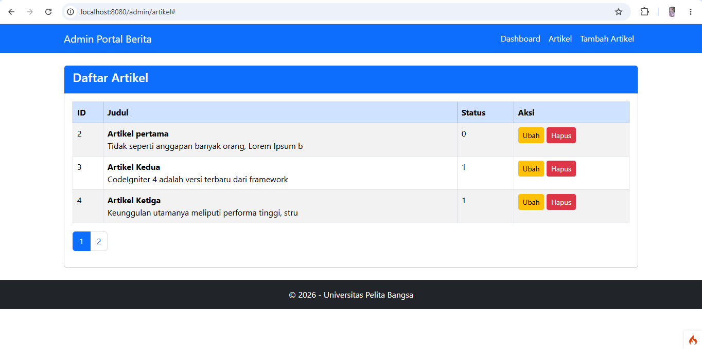

Nama : YUNI HIDAYANI
NIM : 311910078
Kelas : 1243B (B311 FT-FH)
Mata Kuliah : Pemrograman Web 2

Praktikum 5 - Pagination dan Pencarian

Tujuan Praktikum
1. Memahami konsep pagination pada CodeIgniter 4.
2. Mengimplementasikan pencarian data artikel.
3. Menggabungkan fitur pencarian dengan pagination.
4. Menampilkan data secara lebih terstruktur dan efisien.

Langkah-Langkah Praktikum
1. Menambahkan Pagination
Pagination digunakan untuk membatasi jumlah data yang ditampilkan dalam satu halaman sehingga proses pengelolaan data menjadi lebih mudah.
Controller dimodifikasi dengan menggunakan method paginate() pada model artikel.

2. Menambahkan Form Pencarian

Ditambahkan form pencarian pada halaman admin artikel.
Pengguna dapat mencari artikel berdasarkan kata kunci yang dimasukkan pada form pencarian.

Hasil Pengujian

Menampilkan Pagination pada Data Artikel 
Data artikel berhasil ditampilkan dengan sistem pagination.
Screenshot:

Pencarian Data Artikel
Pengguna dapat mencari artikel berdasarkan judul atau kata kunci tertentu.
Screenshot:

Kesimpulan
Pada praktikum ini berhasil diimplementasikan fitur pagination dan pencarian data menggunakan CodeIgniter 4. Fitur pagination membantu membatasi jumlah data yang ditampilkan pada setiap halaman, sedangkan fitur pencarian memudahkan pengguna menemukan data artikel secara cepat dan efisien.

